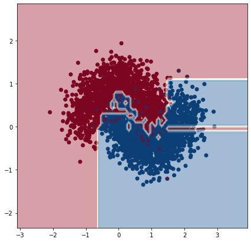
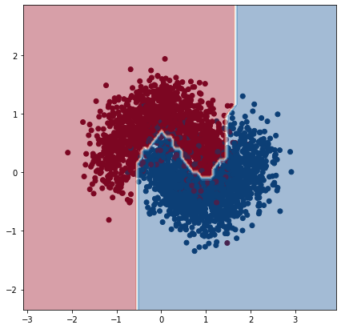
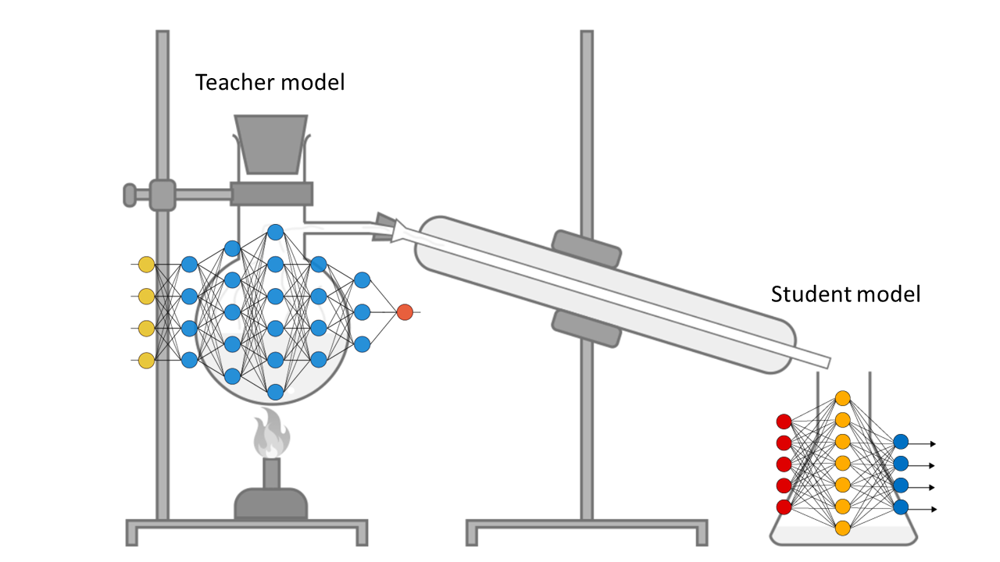

# Knowledge Distillation
Knowledge Distillation describes a general framework of transfering the knowledge of a large and complex model into a smaller and simpler one. The main purpose to do this is to allow for faster inference times (e.g. in a smartphone) without significantly compromising performance (accuracy, square error, etc)

## Soft labels are regularizers
One of the main problems in machine learning is achieving good generalization on unseen data. And one requirement for this is to have a model with low variance in order to avoid overfit and produce smooth decision functions (classification) or predictions (regression). That's why it's common to use complex ensemble models consisting of multiple learners that are combined to produce the final prediction (boosting, bagging). Or to apply regularization techniques such as dropout. But these models tend to need extra memory and computation time not only during training but evaluation phase too.

<figure>
    
    <figcaption><i>Neural network. Test accuracy 90%</i></figcaption>
</figure>

This is a very simple example of a learned decision boundary for a binary classification problem with high noise and overlap between classes. This is learned by a neural network with 2 hidden layers (128, 128). The network's parameters are enough to capture the undelying decision function but without having too much freedom overfitting to the high noise of the points.  

One could argue that once we have this learned function produced by a "complex" model we can just use it to train again another, simpler model to reproduce it. We basically want our simple model to "overfit" this function, since we know it generalizes well.

We picked a decision tree as our simple model.  
- To the left, we trained a clasification tree using the original hard labels (0/1) and let it grow indefinitely and overfit.  
- To the right, we trained a regression tree (since classification trees can't be trained with soft targets) but using as labels the predictions of the neural network. Again, no regularization (pruning) was applied.

<table>
<tr>
<td>
<figure>
    
    <figcaption><i>Decision Tree trained with hard labels. Test accuracy 86.5%</i></figcaption>
</figure>
</td>
    
<td>
<figure>
    
    <figcaption><i>Decision Tree trained with <b>soft</b> labels. Test accuracy 90%</i></figcaption>
</figure>
</td>
</tr>
</table>

The first decision tree of course doesn't perform well since it is affected by the high noise in the dataset and its decision boundary exhibits artifacts leading to low test accuracy. 

But we see how the second tree, without any regularization, converged to the same decision function as the regularized neural network and achieved the same test performance.

## Neural Network Knowledge Distillation on MNIST data
We apply the above ideas on the MNIST dataset. The "teacher" model that will be used to produce the soft labels is a neural network with 32 convolutional filters of size 3x3 and 2 wide hidden fully-connected layers of 1200 units each. Also, each hidden layer is followed by a dropout layer. The "student" model is a much smaller network with 2 hidden layers of only 10 units each and no convolution or dropout layers.

<figure>
    
    <figcaption><i>A ridiculous visualization of the knowledge distillation method</i></figcaption>
</figure>

 
 
<table>
<th>Model</th>
<th>Accuracy</th>
<th>Test errors</th>

<tr>
<td>Teacher</td>
<td>97.5%</td>
<td>248</td>
</tr>

<tr>
<td>Student on hard labels</td>
<td>86.3%</td>
<td>1366</td>
</tr>

<tr>
<td>Student on soft labels</td>
<td>93.0%</td>
<td>696</td>
</tr>
</table>
 

The small model achieves only 86.3% accuracy using hard labels. Astonishingly, the same network trained on soft labels achieves 93% accuracy making 50% less errors on test data.

